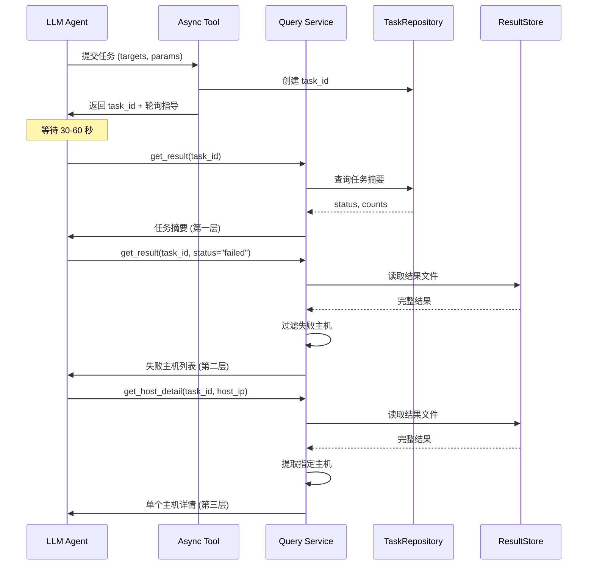

# 设计文档：增强型异步任务查询系统

## 概述

本设计实现了一个结构化的三层查询模式，用于增强现有的异步任务执行系统。当前系统中，所有异步工具（ansible_shell、ansible_copy、ansible_fetch、check_host_status）都返回 task_id 并支持通过 get_result 进行基本的结果查询。本增强功能添加了：

1. **即时验证响应**：为 LLM 代理提供清晰的轮询指导
2. **三层查询模式**：任务摘要 → 主机列表 → 单个主机详情
3. **结构化统计信息**：显示成功/失败主机数量
4. **单个主机详情查询**：通过 task_id + 主机 IP 查询

### 设计目标

- 为 LLM 代理提供清晰、渐进式的任务结果访问，避免上下文过载
- 保持与现有实现的向后兼容性
- 优化查询性能，避免不必要的数据加载
- 提供清晰的错误消息和使用指导

### 关键设计决策

1. **三层查询架构**：采用渐进式信息披露模式，允许 LLM 代理从高层概览逐步深入到具体主机详情
2. **混合存储策略**：任务摘要存储在 SQLite（TaskRepository），详细结果存储在 JSON 文件（ResultStore）
3. **向后兼容性**：保持现有 API 签名不变，通过可选参数扩展功能
4. **性能优化**：摘要查询仅访问数据库，避免读取大型 JSON 文件

## 系统架构

### 三层查询模式

```
第一层：任务摘要查询
├─ 输入：task_id
├─ 数据源：TaskRepository (SQLite)
└─ 输出：task_id, status, total_hosts, success_count, failed_count

第二层：主机列表查询（按状态过滤）
├─ 输入：task_id + status ("failed" | "success")
├─ 数据源：ResultStore (JSON 文件)
└─ 输出：filtered_hosts {host_ip: {rc, stdout, stderr, status}}

第三层：单个主机详情查询
├─ 输入：task_id + host_ip
├─ 数据源：ResultStore (JSON 文件)
└─ 输出：host_ip, rc, stdout, stderr, status
```

### 组件交互图



### 数据流

1. **任务创建阶段**
   - 异步工具验证参数
   - 创建 task_id 并存储到 TaskRepository
   - 立即返回 task_id 和轮询指导

2. **任务执行阶段**
   - 后台线程执行任务
   - 更新 TaskRepository 状态
   - 完成后保存详细结果到 ResultStore

3. **查询阶段**
   - 第一层：从 TaskRepository 读取摘要
   - 第二层：从 ResultStore 读取并过滤
   - 第三层：从 ResultStore 读取并提取

## 组件和接口

### 1. 增强的 get_result 工具

**功能**：提供三层查询能力的统一接口

**接口签名**：
```python
def get_result(
    task_id: str,
    status: Optional[str] = None
) -> Dict[str, Any]
```

**参数说明**：
- `task_id` (必需)：任务 ID
- `status` (可选)：状态过滤器，可选值 "failed" 或 "success"

**返回值格式**：

*第一层：任务摘要（status 参数省略）*
```json
{
  "task_id": "xxx",
  "status": "completed",
  "total_hosts": 10,
  "success_count": 8,
  "failed_count": 2,
  "message": "使用 get_result(task_id, status='failed') 查看失败主机"
}
```

*第二层：失败主机列表（status="failed"）*
```json
{
  "task_id": "xxx",
  "status": "completed",
  "failed_hosts": {
    "192.168.1.10": {
      "rc": 1,
      "stdout": "",
      "stderr": "command not found",
      "status": "failed"
    }
  },
  "total_failed": 2,
  "message": "使用 get_host_detail(task_id, host_ip) 查看单个主机详情"
}
```

*第二层：成功主机列表（status="success"）*
```json
{
  "task_id": "xxx",
  "status": "completed",
  "success_hosts": {
    "192.168.1.11": {
      "rc": 0,
      "stdout": "output",
      "stderr": "",
      "status": "success"
    }
  },
  "total_success": 8
}
```

**错误响应**：
```json
{
  "task_id": "xxx",
  "status": "not_found",
  "message": "任务 xxx 在数据库中未找到"
}
```

```json
{
  "task_id": "xxx",
  "status": "error",
  "message": "无效的 status 参数，有效值为 'failed' 或 'success'"
}
```

### 2. 新增 get_host_detail 工具

**功能**：查询指定主机的执行详情

**接口签名**：
```python
def get_host_detail(
    task_id: str,
    host: str
) -> Dict[str, Any]
```

**参数说明**：
- `task_id` (必需)：任务 ID
- `host` (必需)：主机 IP 地址

**返回值格式**：

*成功响应*
```json
{
  "task_id": "xxx",
  "host": "192.168.1.10",
  "rc": 1,
  "stdout": "",
  "stderr": "command not found",
  "status": "failed"
}
```

*错误响应*
```json
{
  "task_id": "xxx",
  "host": "192.168.1.10",
  "status": "not_found",
  "message": "主机 192.168.1.10 在任务结果中未找到"
}
```

```json
{
  "task_id": "xxx",
  "status": "running",
  "message": "任务仍在运行中，请稍后查询"
}
```

### 3. 异步工具响应增强

所有异步工具（ansible_shell、ansible_copy、ansible_fetch、check_host_status）的响应格式保持不变，但在超时情况下增强消息指导：

**55秒内完成**：
```json
{
  "task_id": "xxx",
  "status": "completed",
  "results": { ... }
}
```

**超过30秒（运行中）**：
```json
{
  "task_id": "xxx",
  "status": "running",
  "message": "任务正在后台运行。每 30-60 秒使用 get_result('xxx') 轮询结果。"
}
```

## 数据模型

### TaskRepository 数据格式

存储在 SQLite 数据库中，包含任务摘要信息：

```python
{
    "task_id": str,          # UUID 格式
    "status": str,           # "pending" | "running" | "completed" | "failed"
    "created_at": str,       # ISO 8601 时间戳
    "updated_at": str,       # ISO 8601 时间戳
    "result": {              # 摘要信息
        "status": str,
        "total_hosts": int,
        "success_count": int,
        "failed_count": int
    }
}
```

### ResultStore 数据格式

存储在 JSON 文件中（`logs/task_results/task_{task_id}.json`），包含完整的主机级别结果：

```python
{
    "task_id": str,
    "saved_at": str,         # ISO 8601 时间戳
    "results": {
        "task_id": str,
        "status": str,
        "success_hosts": List[str],  # 成功主机 IP 列表
        "results": {                  # 所有主机的详细结果
            "192.168.1.10": {
                "rc": int,
                "stdout": str,
                "stderr": str,
                "status": str
            },
            "192.168.1.11": { ... }
        }
    }
}
```

### 主机结果数据结构

每个主机的执行结果包含以下字段：

```python
{
    "rc": int,              # 返回码（0 表示成功）
    "stdout": str,          # 标准输出
    "stderr": str,          # 标准错误
    "status": str           # "success" | "failed"
}
```

## 正确性属性

